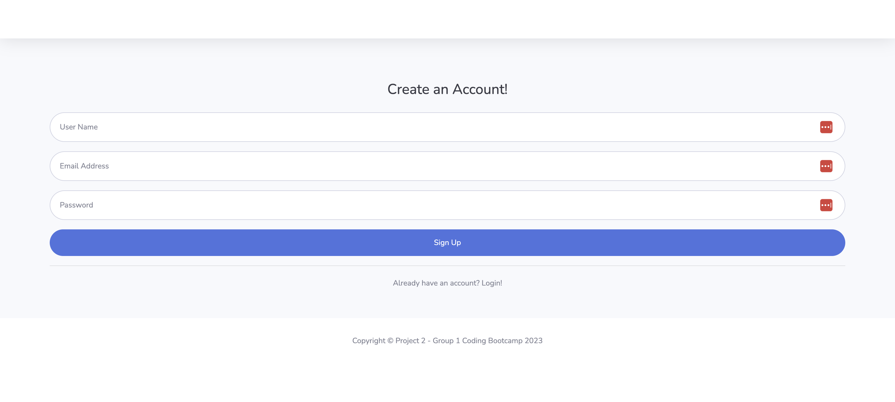

# Project Inventory

## Description

Project Inventory is a full stack application that allows users to track and manage company resources in an online inventory. It provides a user-friendly interface for employees and managers to view, add, and subtract inventory items, ensuring efficient resource management and reordering.
Please visit the application [here](link).

## Table of Contents
- [Installation](#installation)
- [Usage](#usage)
- [Credit](#credit)
- [License](#license)
- [Author](#authors)

## Installation
To run the Project Inventory application locally, follow these steps:

1. Clone the repository to your local.
2. Install the dependencies: `npm install`
3. Set environment variables: Rename the `.env.EXAMPLE` file into `.env` and fill in the DB_USER and DB_PASSWORD with your database credentials and save the file.
4. Set up the database: 

    * Navigate to db directory and open the mySql shell and execute the schema.sql by running `source schema.sql` to create database.
    * Navigate to root directory and run `npm run seed` to seed data to your database.

5. Start the server: `npm start`

## Usage 
Once the application is up and running, follow these steps to use Project Inventory:

1. Access the application through your web browser.
2. Create an account or log in if you already have one.

3. Browse the online warehouse to view available inventory items.
4. Click on one of the category to view the items and quantity.
(Add Screenshot)
5. Click on the item to view the description and modify the stock.
6. Specify the number using the +/- buttons then click Add Stock or Reduce Stock to modify the quantity.
(Add Screenshot)
7. Keep track of inventory levels and reorder resources as necessary.
8. Log out when finished.

## Credit
- [Bootstrap](https://startbootstrap.com/previews/sb-admin-2)

## License
Please refer to the LICENSE in the repo.

## Authors
- © 2023 [Ben](https://github.com/BenCuttance), [Sebastian](https://github.com/Sebastianrod8), [Ge](https://github.com/gesu001), and [Maya](https://github.com/retnodamayanti).
